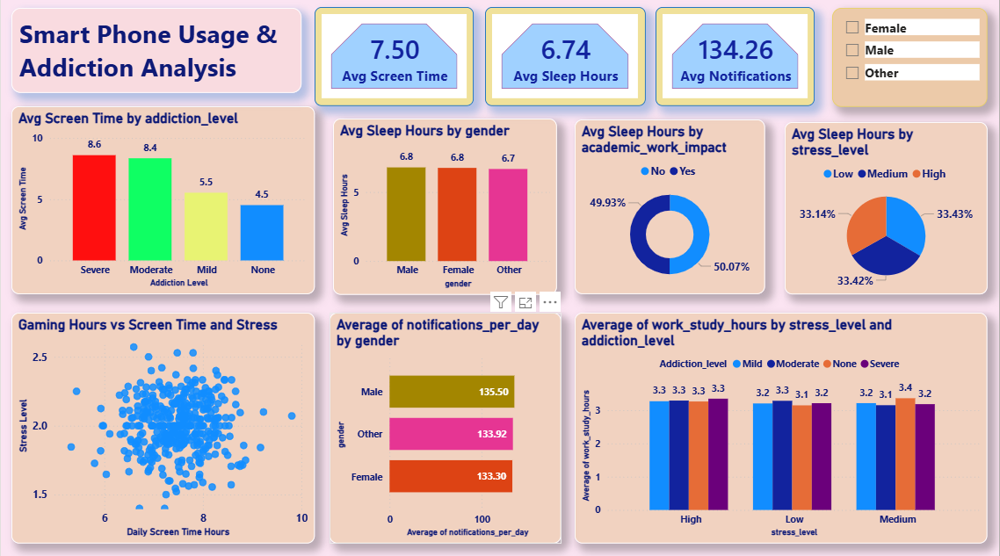

# 📱 Smart Phone Usage and Addiction Analysis (Power BI)

## 📌 Project Overview

This project presents an interactive **Smart Phone Usage and Addiction Analysis Dashboard** built using **Power BI**. It analyzes user behavior patterns related to screen time, sleep, stress levels, and smartphone addiction.

The dashboard helps identify relationships between smartphone usage and its impact on productivity, mental well-being, and lifestyle patterns.

---

## 📸 Dashboard Preview

<p align="center">
  
</p>

---

## 🔍 Key Insights from Dashboard

* 📱 **Screen Time Analysis**: Higher addiction levels are associated with increased screen time
* 😴 **Sleep Impact**: Average sleep duration decreases with higher smartphone usage
* 🔔 **Notification Behavior**: High notification frequency indicates increased engagement and potential distraction
* 😟 **Stress Correlation**: Strong relationship between screen time, gaming hours, and stress levels
* 🎯 **Productivity Impact**: Academic/work performance influenced by smartphone addiction
* 👥 **Gender-Based Insights**: Comparison of sleep patterns and notification usage across gender

---

## 🗂️ Data Sources

* **Smartphone_Usage_And_Addiction_Analysis.csv** – Contains user behavior data including screen time, sleep, stress, and notifications

---

## ⚙️ Tools & Technologies Used

* **Power BI Desktop**
* **Power Query** – Data cleaning & transformation
* **DAX (Data Analysis Expressions)** – Measures & calculations

---

## 🔄 Data Preparation

* Cleaned and transformed raw dataset using Power Query
* Handled missing values and inconsistencies
* Standardized categorical variables (addiction level, stress level, gender)
* Prepared data for behavioral and correlation analysis

---

## 🧠 Data Modeling

* Designed an efficient data model for analysis
* Created DAX measures for:

  * Average screen time
  * Average sleep hours
  * Notifications per day
* Optimized model for performance and interactivity

---

## 📈 Dashboard Features

### 📊 Usage Analysis

* Average screen time by addiction level
* Notifications per day by gender
* Key KPIs: screen time, sleep hours, notifications

### 😴 Lifestyle Analysis

* Sleep hours by gender
* Sleep distribution based on academic/work impact
* Sleep vs stress level

### 😟 Stress & Behavior Analysis

* Gaming hours vs screen time vs stress (scatter plot)
* Work/study hours vs stress and addiction level

### 👥 Demographic Insights

* Gender-based comparison of behavior patterns

---

## 📊 Key Metrics

* Avg Screen Time: **7.50 hrs**
* Avg Sleep Hours: **6.74 hrs**
* Avg Notifications: **134/day**

---

## 🚀 How to Use

1. Download the `.pbix` file from the `dashboard` folder
2. Open in **Power BI Desktop**
3. Refresh data if needed
4. Explore insights using filters and visuals

---

## 📁 Project Structure

```id="9w7h2u"
Smart-Phone-Usage-and-Addiction-Analysis
 ┣ 📂 dashboard
 ┃ ┗ Smart Phone Usage and Addiction Analysis.pbix
 ┣ 📂 data
 ┃ ┗ Smartphone_Usage_And_Addiction_Analysis.csv
 ┣ 📂 images
 ┃ ┗ dashboard.png
 ┗ README.md
```

---

## 🎯 Future Enhancements

* Predictive modeling for addiction levels
* Integration with real-time usage tracking data
* Advanced behavioral segmentation
* Enhanced UI/UX with dynamic dashboards

---

## 🤝 Contributing

Contributions are welcome! Feel free to fork this repository and submit a pull request.

---

## 📬 Contact

For any queries or feedback, feel free to connect.
